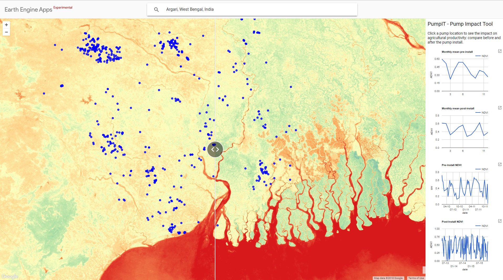

# Google Earth Engine User Summit 2018 Hackathon

The 2018 Google Earth Engine User Summit featured a 5hr Hackathon ([topics](https://sites.google.com/earthoutreach.org/eeus2018/agenda/hackathon)), where participants could hack together a quick proof-of-concept of ideas they brought to the conference using the Google Earth Engine platform.

This repository contains the outline of the Hackathon topic "Evaluating the Impact of Irrigation Investments on Agricultural Productivity" and the code for the resulting prototype "PumpIT - The Pump Impact Tool" for West Bengal, India.

Participants: Ankan De, Jonna van Opstal, Kersten Clauss

- [Topic proposal](https://docs.google.com/document/d/1B4vNH9T8AbjEO7R_p9x-6JJ3DP9kJwKZCauDte9IBmI/edit)
- [Presentation slide-deck](https://docs.google.com/presentation/d/1yARNu9KOWvyyH-r1pxUsfg_2x40piG_vnF7enbHGzP4/edit#slide=id.g3c5fd1ce4d_0_0)

- [PumpIT (Earth Engine App)](https://kersten.users.earthengine.app/view/pumpit)
- [source code](PumpIT.js)

## PumpIT Earth Engine App

In this Hackathon we explored the new feature of Earth Engine Apps combined with the large Landsat archive to create the prototype of an App that can be used as a decision support tool to measure the impact of pump irrigation pre- and post-install of the pump.

The app features a slider showing the NDVI pre-install (left) and post-install (right) as well as the pump locations (blue dots). Clicking on a dot produces charts showcasing productivity proxies (NDVI in this case) before and after pump install as monthly average and over a 3 year time-series.

The code can be used as a sceleton/outline to create decision support tools employing any Earth Engine derived/derivable dataset.

## Topic proposal

In developing countries, Governments and International Development Agencies invest heavily in irrigation to better support the development of the Agricultural Sector. Due to a general absence of data as well as lack of reliable sources of data/information, it is often difficult to evaluate the actual impact of these projects on Agricultural Productivity. It is also sometimes difficult ti establish an accurate baseline for reference.
 
The goal of this Hackathon Project would be to have a single window of information on how productivity has been changing over time for areas where government/ development agencies may have active projects. A simple tool such as this will also better allow the management of Water User Associations (WUA) which are run by communities and will help benchmark WUA performance using Productivity as a measure. Such a system of reference will allow for planning more targeted support for communities which may need greater hand holding, while also recognizing the ones which are performing well. While the idea presented is simple, it has potential for great use in the ongoing efforts to strive towards “Irrigation Benchmarking”.

This tool can eventually ingest on ground productivity data and help present validated productivity information.
 
In the subsequent iteration of this tool, it can further be expanded to help inform and facilitate decisions pertaining to irrigation management and scheduling.

